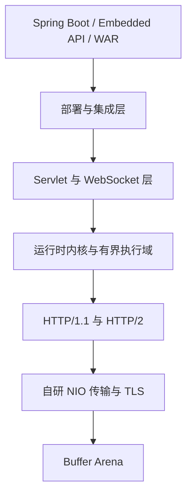
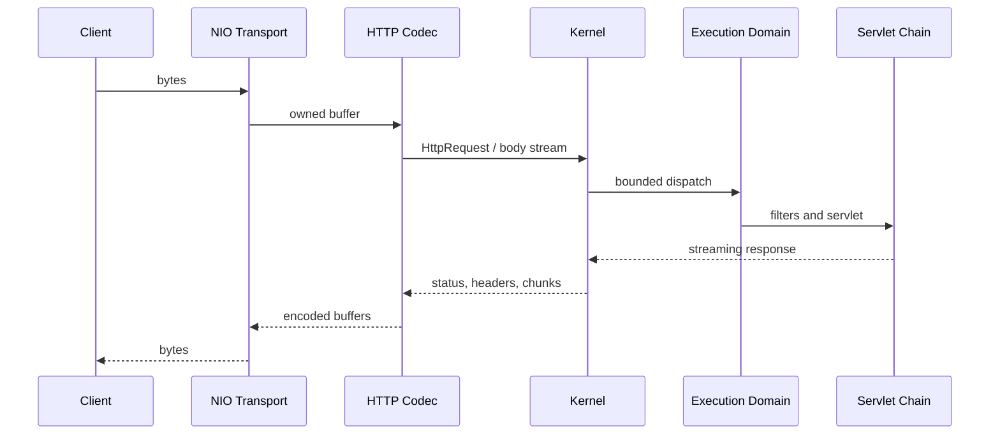

# 架构概览

## 分层结构

| 模块 | 责任 |
| --- | --- |
| `buffer` | 缓冲区租借、归还和所有权约束 |
| `transport-api` | 传输配置、TLS、ALPN、压缩与代理抽象 |
| `transport-nio` | Selector、连接状态机、超时和网络读写 |
| `http-core` | HTTP 请求响应模型、流式邮箱和链路跟踪 |
| `http1` | HTTP/1.1 解析与编码 |
| `http2` | 帧、HPACK、流、多路复用与流控 |
| `execution` | 有界工作线程和拒绝策略 |
| `servlet` | Servlet 映射、Filter、Session、异步与分派 |
| `websocket` | 握手、帧、JSR 356 与客户端/服务端能力 |
| `deployment` | WAR、展开目录与描述符装载 |
| `kernel` | 生命周期、协议路由、管理与指标 |
| `embed` | 面向使用者的组合入口 |
| `spring-boot-2.7` | Spring Boot WebServer 适配 |

## 一次请求如何流动

网络线程负责连接状态、解析推进和输出，不直接运行用户 Servlet。用户代码进入有界
执行域；队列满时应显式拒绝，防止无限堆积把延迟问题变成内存故障。

## 背压与所有权

请求体和响应体通过有界邮箱逐块交付。高水位触发暂停，消费下降到低水位后恢复，
把慢客户端产生的压力反馈到传输层。缓冲区租约用于表达“谁能读写、谁负责归还”，
避免池化缓冲区在异步链路中被重复释放或提前复用。

## 与传统实现的区别

灵童并不追求类名、内部对象模型或专有配置与 Tomcat/JBoss/Undertow 相同。兼容面是
标准 Servlet、JSR 356、HTTP 语义和 Spring Boot WebServer 契约；容器私有 API
不属于兼容承诺。这让内部可以保持明确的边界，但也意味着迁移必须识别专有依赖。

